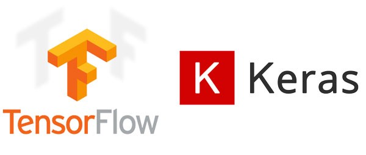
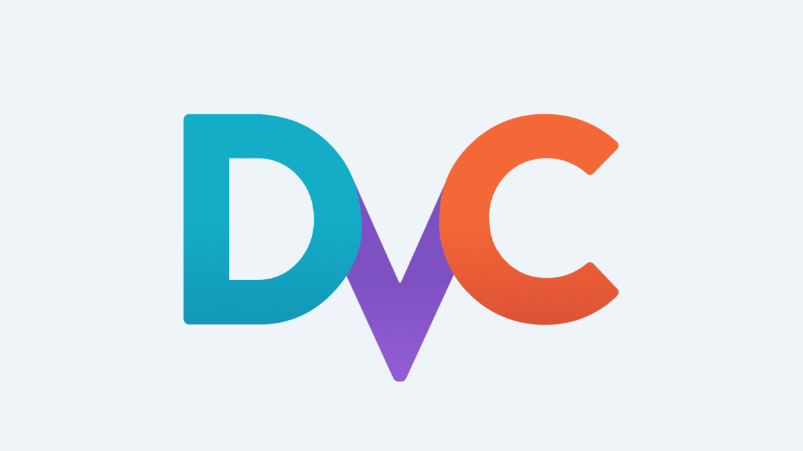
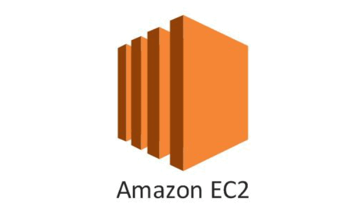
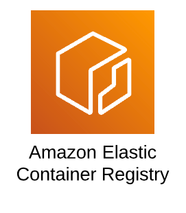

# Interstate_Traffic_Volume_Project
Metro Interstate traffic volume project

### Tools Used

    
    
    
    

    
    
    
    

## Workflows

- config.yaml
- secrets.yaml [Optional]
- params.yaml
- Entity
- Configuration manager in src config
- Components
- Pipeline
- main.py
- dvc.yaml

### Installation

- pip install -r requirements.txt

### DVC commands
- dvc init
- dvc repro

### To Run
- python app.py

### Update configuration
- Update params.yaml with configuration which is apt for your training eg: batch size to 500 and epochs to 200.

### Documents

- [Link here](./documents)

